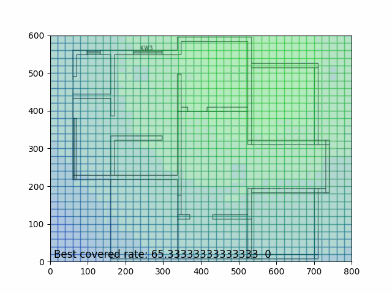
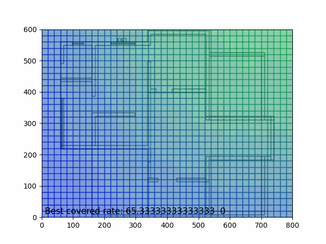

# Bài Tập Môn Học - Robot Bầy Đàn

## Giới Thiệu

Chào mừng đến với kho lưu trữ các bài tập môn học của khóa học mùa thu 2024 về robot bầy đàn tại Đại học Công nghệ - UET. 

## Mục Tiêu

Kho lưu trữ này nhằm mục đích cung cấp tài liệu và mã nguồn cho các bài tập, dự án và thực hành trong môn học về robot bầy đàn. 

## Các Nội Dung
1. **Giải quyết vấn đề người du lịch (TSP) bằng thuật toán tối ưu hóa của một đàn kiến (ACO)**
    - Folder: [Week2](Week2)
    - Mô tả: Dự án này tập trung vào việc giải quyết vấn đề người du lịch (TSP) thông qua việc áp dụng thuật toán tối ưu hóa của một đàn kiến (ACO).

2. **Mô phỏng kiến trúc phản ứng sử dụng mạng nơ ron nhân tạo cho robot e-puck**
    - Folder: [Week3](Week3)
    - Mô Tả: Dự án này tập trung vào nghiên cứu và mô phỏng việc áp dụng mạng nơ ron nhân tạo trong việc điều khiển robot e-puck.

3. **Điều khiển robot với giải Thuật Artificial Potential Field - APF**
    - Folder: [Week4](Week4)
    - Mô Tả: Dự án này giới thiệu phương pháp Trường tiềm năng (Artificial Potential Field - APF) và mô phỏng cách áp dụng nó để điều khiển di chuyển của robot.

4. **Flocking Reynolds**
    - Folder: [Week5](Week5)
    - Mô Tả: Dự án này cung cấp mã nguồn Python để mô phỏng thuật toán Flocking Reynolds, một phương pháp mô phỏng hành vi đàn bầy trong lập trình máy tính đồ hoạ.

5. **Mô phỏng đội hình bay V-shaped bằng Pygame**
    - Folder: [Week6](Week6)
    - Mô Tả: Dự án này mô phỏng việc tổ chức và điều chỉnh đội hình bay theo hình dáng V-shaped bằng cách sử dụng Pygame. Dù đơn giản, dự án cung cấp một cái nhìn tổng quan về cách tổ chức đội hình bay và là một bước khởi đầu để tìm hiểu sâu hơn về các phương pháp tối ưu hóa hiệu suất bay.

6. **Phỏng Điều Khiển Bao Phủ Đa Robot Trong Môi Trường Có Cấu Trúc Bất Kỳ**
    - Folder: [Week7](Week7)
    - Mô Tả: Chương trình mô phỏng này mô tả quá trình điều khiển bao phủ đa robot trong một môi trường có cấu trúc bất kỳ. Trong môi trường này, các robot cần phải tìm cách chiếm đóng các điểm trên bản đồ một cách hiệu quả để bảo vệ và giám sát các khu vực quan trọng.

7. **Chương Trình PSO Tối Ưu Vùng Bao Phủ Mạng WiFi**
    - Folder: [Week8](Week8)
    - Mô Tả: Chương trình sử dụng thuật toán PSO để tối ưu vùng bao phủ của mạng WiFi đa điểm truy cập.

9. **Mô phỏng thuật toán theo dõi đa mục tiêu (MTT) của hệ thống đa robot**
    - Folder: [Week9](Week9)
    - Mô Tả: Chương trình này là một mô phỏng của thuật toán theo dõi đa mục tiêu (MTT) được triển khai cho một hệ thống đa robot. Thuật toán này giúp các robot trong hệ thống tìm và theo dõi nhiều mục tiêu cùng một lúc.

10. **Mô phỏng Định tuyến mạng bằng Pygame và thuật toán DSDV**
    - Folder: [Week10](Week10)
    - Mô Tả: Dự án này là một mô phỏng sử dụng Pygame để tạo ra một mạng của các node và thực hiện định tuyến giữa chúng. Trong dự án này, thuật toán Định tuyến DSDV (Destination-Sequenced Distance Vector Routing) được áp dụng để quản lý việc định tuyến trong mạng.
    

## Đóng Góp

Nếu bạn muốn đóng góp vào kho lưu trữ này hoặc phát hiện lỗi, vui lòng tạo một issue hoặc gửi pull request. Mọi đóng góp đều được đánh giá cao.

## Tác Giả

Kho lưu trữ được phát triển bởi Mr-QB (Quốc Bảo).

