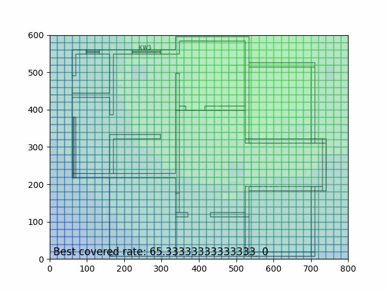
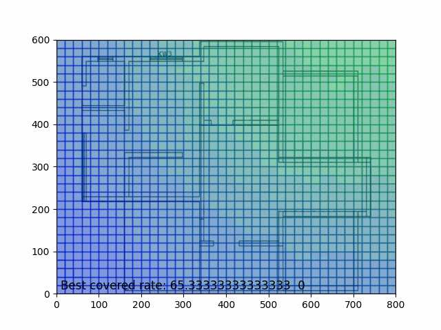

# Tối Ưu Vùng Bao Phủ Mạng WiFi Đa Điểm Truy Cập Sử Dụng PSO

## Giới thiệu
Chương trình này sử dụng thuật toán Particle Swarm Optimization (PSO) để tối ưu vùng bao phủ của mạng WiFi với nhiều điểm truy cập. Bằng cách di chuyển các "particle" (điểm truy cập) thông qua không gian, chương trình cố gắng tìm ra vị trí tốt nhất cho mỗi điểm truy cập để tối đa hóa vùng bao phủ mạng.

## Cách Sử Dụng
1. Chạy chương trình `main.py`.
2. Chờ đợi cho quá trình tối ưu hoàn thành.
3. Kết quả sẽ được lưu lại dưới dạng file GIF và các hình ảnh PNG.

## Sơ lược về thuật toán được áp dụng
Dưới đây là các bước cơ sở của PSO được áp dụng trong chương trình

### Bước 1: Khởi Tạo

1. Khởi tạo một số lượng lớn các "particles" (điểm truy cập) trong không gian tìm kiếm.
2. Đặt vị trí ban đầu và vận tốc ban đầu cho mỗi particle.
3. Tính toán tốc độ và vị trí ban đầu dựa trên nguyên tắc của PSO.

### Bước 2: Đánh Giá

1. Đánh giá hiệu suất của mỗi particle dựa trên mức độ bao phủ mạng WiFi.
2. Cập nhật vị trí tốt nhất mà mỗi particle từng đạt được (pbest) và vị trí tốt nhất trong toàn bộ quần thể (gbest).

### Bước 3: Di Chuyển

1. Dựa trên pbest và gbest, tính toán vận tốc mới cho mỗi particle.
2. Di chuyển mỗi particle đến vị trí mới dựa trên vận tốc đã tính toán.

### Bước 4: Kiểm Tra Dừng

1. Kiểm tra điều kiện dừng, ví dụ như số lần lặp tối đa hoặc không có sự thay đổi đáng kể trong một khoảng thời gian dài.
2. Nếu điều kiện dừng được đáp ứng, kết thúc thuật toán và trả về kết quả.

### Bước 5: Lưu Kết Quả

1. Lưu trữ kết quả các lần lặt thành file quan sát cuối dạng gif.

## Các Tập Tin
- `main.py`: Chương trình chính thực thi PSO và tạo ra các file đầu ra.
- `supportFunction.py`: Các hàm hỗ trợ cho việc tính toán và vẽ hình ảnh.
- `Agent.py`: Định nghĩa lớp Agent để đại diện cho các điểm truy cập.
- `Setting.py`: Các cài đặt và hằng số cho chương trình.
- `Week8\Input\house_cad.png`: Hình ảnh nền đại diện cho vùng cần phủ sóng.
- `Week8\Output\`: Thư mục chứa các file hình ảnh đầu ra.
- `Week8\Demo\`: Thư mục chứa file GIF kết quả.

## Thư Viện
- `matplotlib`: Để vẽ hình ảnh và biểu đồ.
- `numpy`: Để xử lý dữ liệu số học.
- `imageio`: Để tạo file GIF từ các hình ảnh.
- Các thư viện tiêu chuẩn khác của Python.

Một đoạn video demo ngắn của chương trình.

